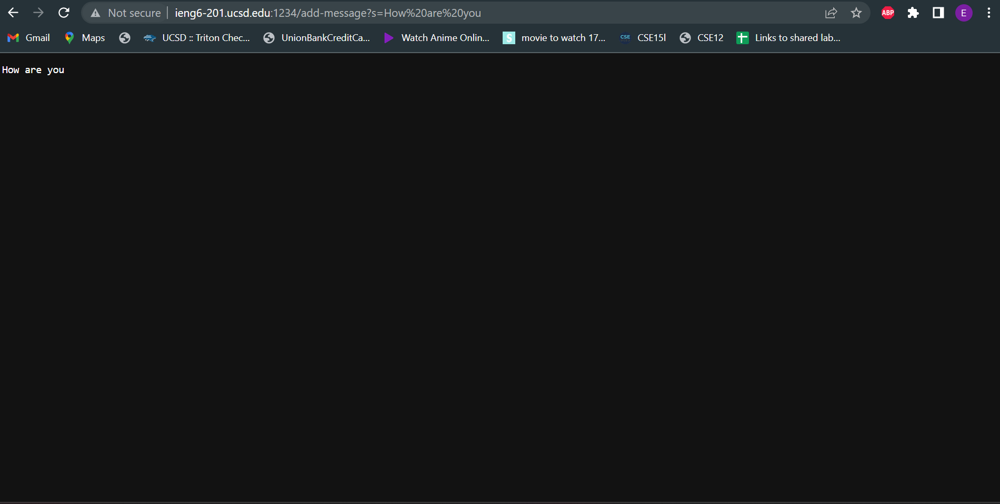

# lab-report-2

This is the code I made for StringServer, 
The functionality for the server is made in the StringHandeler class
which essentially is designed to search for either a / symbol or a /add-message at the end 
of the URL. Based on which it finds, the server will either display the messages that have been
added so far, or if propted to add a message the server will take in a request and add the message onto 
the end of the string.

Here are some screenshots of using /add-message, as you can see by adding a message into the URL
the web server will add the message onto a new line of the growing string. Note that the end of the path
looks like this: /add-message?s=How are you

In this specific screenshot the methods called are: url.getPath().contains("/add-message") is called in order to verify that the path contains this specific string.
This is true, and the next method that is called is url.getQuery(). This returns the part of the path after the "?" symbol. The query in this case is s=How are you. The next method that is called is the split method, with an argument of "=". Calling split("=") and assinging the output to an array called parameters allows us to seperate the "s" and the "How are you" strings. From there we can use the .equals method on parameters[0] to verify that it is the string "s", and then we can concatenate the contents of parameters[1], which is "How are you", on the variable str, along with a new line character. This completes the functionality of the handleRequest method. This is called whenerever the webesite is loaded in.

Here is another example where I have added in multiple messages to the string, as you can see
the new message will be added to the previous message(s) in the next line.

In this screenshots the methods called are url.getPath().contains("/add-message") method in order to figure out if the path contains 
/add-message, if this is not in the path we will exit the if statement, any path other than "/" and "/add-message" will return "404 page not found". If the path is
/add-message the method url.getQuery() is used to get the paths Query. The Query is the part of the path after the "?" symbol. Next the split method
is called in order to seperate the two sides of the "=" in the Query. The two strings are saved in an array called parameters of size 2. If parameters[0]
is equal to "s" then the method continues and concatenates the value of parameters[1] to the variable str. This concatenation allows us to later display the value of 
the first added message after we add the second message. This entire process can be done as many times as you would like, in this specific example I only added to the string twice.
